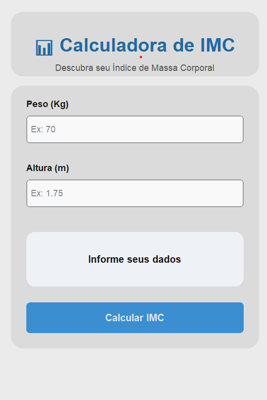

# 📊 Calculadora de IMC – Aplicação Desktop


<p align="center">
  
</p>

---

## 📌 Sobre o Projeto
A **Calculadora de IMC** é uma aplicação desktop desenvolvida em Python com **CustomTkinter**, projetada para calcular o Índice de Massa Corporal de forma rápida, intuitiva e visualmente agradável.  
O sistema não utiliza banco de dados ou arquivos externos, garantindo leveza, simplicidade e fácil execução.

---

## ✨ Funcionalidades
- ⚖️ Cálculo automático do IMC  
- 🎯 Classificação por faixa de peso  
- 🎨 Feedback visual por cores  
- 🛡️ Validação de dados de entrada  
- 💡 Interface moderna e intuitiva  

---

## 🛠️ Tecnologias Utilizadas
- **Linguagem:** Python 3.10+  
- **Interface Gráfica:** CustomTkinter  
- **Estilo e Layout:** Design em cards  
- **Documentação:** Markdown  

---

## 📘 Documentação
Para mais detalhes sobre o funcionamento interno e o uso do sistema, consulte:
* [📄 **Documentação Técnica**](./docs/tecnico.md): Estrutura do projeto, módulos e fluxo de dados.
* [👤 **Manual do Usuário**](./docs/manual_usuario.md): Guia passo a passo para utilização do sistema.

---

## 🚀 Melhorias Futuras
- [ ] 🌙 Modo escuro automático  
- [ ] 📊 Barra visual indicando a faixa do IMC  
- [ ] 💾 Histórico de cálculos  
- [ ] 📦 Geração de versão executável (.exe)  

---

## ⚙️ Instalação e Execução

1. Clone o repositório:
```bash
git clone https://github.com/emival122/calculadora-imc-python.git
